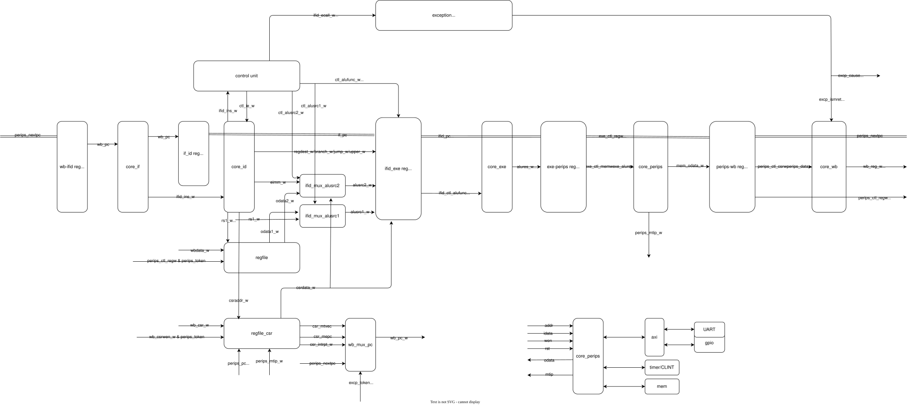

# YScore — 从 0 写一个能跑 C 语言的 RV32I SoC

> 🌐 **Language / 语言：** [**English**](README_en.md) · [**简体中文**](README_zh.md)

> **Yes! core / Your Simple Core** —— 手写 Verilog 的 5 级多周期 RISC-V 处理器 + AXI4-Lite 总线适配 + 裸机 RTOS。

---

## 效果展示




---

## 项目内容

- **处理器**：RV32I + Zicsr 指令集，5 级多周期流水线（IF → ID → EXE → PERIPS → WB），支持 ecall/ebreak 内部异常与 CLINT 定时器中断。
- **总线与外围**：适配 AXI4-Lite Master（读写五通道握手状态机），驱动 UART（AXI-Lite 从机，115200）、GPIO（低电平点亮 LED）、CLINT（64 位 mtime）。
- **内存**：18KB 指令存储 + 24KB 数据存储（4×6KB 字节 bank，滚筒式寻址支持 8/16/32 位）。
- **软件**：裸机抢占式时间片轮转 RTOS，Shell 命令行 + Asteroids 小游戏，适配 C 交叉编译。
- **联调**：QEMU（标准 RV32）先行验证, 只需改 `port` 层移植到 FPGA。

---

## 硬件配置要求

| 项         | 版本/型号                                        |
| ---------- | ------------------------------------------------ |
| 开发板     | 野火 Altera EP4CE10 征途 Pro（Cyclone IV E）     |
| 综合工具   | Quartus Prime 25.1 Standard Edition              |
| 仿真工具   | ModelSim 20.1                                    |
| 交叉编译器 | RISC-V GCC 15.2.0（xPack）`riscv-none-elf-gcc` |
| 构建工具   | CMake ≥ 3.20 + Ninja                            |
| 模拟器     | QEMU`qemu-system-riscv32`                      |
| 操作系统   | Windows 11 / WSL                                 |

**资源占用**：约 10K LE、6~7 个 M9K 块（18KB IMEM + 24KB DMEM），详见 Quartus
编译报告与 `doc/learn/01-hardware-basics/11-fpga-deployment.md`。

---

## 系统架构

### 流水线：token 串行多周期

```
   ┌────────┐   ┌────────┐   ┌────────┐   ┌─────────────┐   ┌──────────┐
   │  IF    │ → │  ID    │ → │  EXE   │ → │   PERIPS    │ → │   WB     │
   │ 取指   │   │ 译码    │   │ 运算   │   │ 访存/外设    │   │ 写回+选PC│
   └────────┘   └────────┘   └────────┘   └─────────────┘   └──────────┘
     core_if     core_id      core_exe     core_perips       core_wb
                 ctl_ifid     ctl_exe      mem_ctl/clint     wb_mux_pc
                 ctl_perips                  axil_master
                 ctl_wb
```

- **同一时刻只有一条指令**：`core_ctl.v` 用一个 if-else 链逐拍推进
  token（`wb_token → if_token → ifid_token → exe_token → perips_token → wb_pending → wb_token`）。

### 控制通路 / 数据通路分离

- 控制：`ctl_ifid.v`（译码源选择/异常识别）、`ctl_exe.v`（ALU/下一PC功能）、
  `ctl_perips.v`（访存使能）、`ctl_wb.v`（回写选择/写使能）。
- 数据：`core_id.v`（字段+立即数）、`core_exe.v`（ALU+next）、`core_wb.v`（回写多路选择）。

### 中断 / 异常通路

| 类型         | 触发              | mepc                                                 | mcause         | 返回     |
| ------------ | ----------------- | ---------------------------------------------------- | -------------- | -------- |
| 定时器中断   | `mtip`（CLINT） | **`perips_nextpc`**（被中断指令真实下一 PC） | `0x80000007` | `mret` |
| ecall/ebreak | 指令本身          | `pc`（异常指令地址，软件 +4）                      | `11` / `3` | `mret` |

`intrpt` 为**寄存器输出**（非组合逻辑），配合 WB 采样拍完成 PC 重定向。

### 内存映射

| 地址区间                      | 外设                            | 访问                  |
| ----------------------------- | ------------------------------- | --------------------- |
| `0x0000_0000 ~ 0x0000_47FF` | 指令存储器 18KB                 | IF 同步读             |
| `0x0200_0000 ~ 0x0200_BFFF` | CLINT（mtime/mtimecmp，50MHz）  | PERIPS 固定 1 拍      |
| `0x1000_0000 ~ 0x1000_001F` | UART（AXI-Lite，115200）        | PERIPS 经 axil_master |
| `0x2000_0000 ~ 0x2000_000F` | GPIO（低 4 位 LED，低电平点亮） | PERIPS 经 axil_master |
| `0x8000_0000 ~ 0x8000_5FFF` | 数据存储器 24KB                 | PERIPS 固定 1 拍      |

### UART 寄存器（AXI-Lite，基址 0x10000000）

参考Z-core

| 偏移 | 名称     | 方向 | 说明                                                         |
| ---- | -------- | ---- | ------------------------------------------------------------ |
| 0x00 | TX_DATA  | W    | 发送字节                                                     |
| 0x04 | RX_DATA  | R    | 接收字节                                                     |
| 0x08 | STATUS   | R    | bit0 tx_empty / bit1 tx_busy / bit2 rx_valid / bit3 rx_error |
| 0x0C | CTRL     | R/W  | 控制                                                         |
| 0x10 | BAUD_DIV | R/W  | 波特率分频（50MHz/(16×115200)≈27）                         |

### RTOS 任务模型

- 静态任务表（8 个），`READY / RUNNING / WAITING` 三状态，
  阻塞原因 `WAIT_DELAY / WAIT_UART / WAIT_SUSPEND`。
- 抢占式时间片轮转：CLINT 每 1ms 触发 tick → `kernel_tick` → `scheduler_switch`。
- 协作式让步：`task_yield()` = `ecall`。
- 5 个任务：`idle` / `uart_rx`(10ms 轮询串口) / `shell`(命令行) / `led`(500ms 闪烁) / `game`(Asteroids)。
- Shell 与 Game 通过"输入所有权令牌"（`input.c`）共享 UART 输入缓冲。

---

## 目录结构

```
yscore/
├── src/                 # 硬件 Verilog
│   ├── core_*.v         # 各流水线阶段
│   ├── ctl_*.v          # 控制通路
│   ├── exe_*.v          # ALU / 下一PC
│   ├── mem_*.v          # 数据存储器（滚筒式字节 bank）
│   ├── axil_*.v         # AXI-Lite 总线/外设
│   ├── regfile*.v       # 寄存器堆 / CSR
│   ├── clint.v / top.v  # 定时器 / 顶层
│   └── rvdef.vh         # 指令/控制编码定义
├── tb/                  # ModelSim 仿真（寄存器/CSR 快照 + 反汇编 + 断点）
├── simulation/modelsim/ # sim.do 一键仿真
├── rtos/                # 固件（CMake 交叉编译）
│   ├── src/             # app/shell/game/input/main
│   ├── sys/             # kernel.c（调度器）/ mem.c
│   ├── port/            # 移植层（QEMU/FPGA 隔离）
│   ├── lib/             # uart/gpio/math/utils
│   ├── include/         # 头文件
│   ├── startup/         # 启动脚本 + 链接脚本
│   ├── bin2mem.py       # ELF → imem.mem / dmem0~3.mem
│   └── CMakeLists.txt
├── ins/                 # 指令测试（RI/LS/branch/others/zicsr/except/test.c）
├── refer/               # 学习笔记（CSR/中断/mstatus/链接脚本等）
└── doc/learn/           # 完整学习文档（见下）
```

---

## Quick Start

### 1. ModelSim 仿真

```bash
cd d:/yscore/simulation/modelsim
vsim -do sim.do          # 编译 RTL + tb，跑 100 万周期
```

### 2. 编译固件

```bash
cd d:/yscore/rtos
cmake -B build -G Ninja
ninja -C build           # → MiniRTOS.elf
ninja -C build dasm      # → 反汇编
ninja -C build bin       # → *_text.bin / *_data.bin
ninja -C build mem       # → imem.mem + dmem0~3.mem（喂给硬件）
```

### 3. QEMU 运行（软件先行验证）

```bash
ninja -C build run       # qemu-system-riscv32 -nographic -machine virt \
                         #   -cpu rv32 -bios none -kernel MiniRTOS.elf
```

### 4. FPGA 上板

1. Quartus 打开 `yscore.qpf`，综合编译。
2. Programmer 烧录 `yscore.sof`。
3. 串口终端 115200 连接，开机应见 banner 与 `RV32> ` 提示符，LED 500ms 闪烁。

### 5. 指令测试

```bash
cd ins
riscv-none-elf-as -march=rv32i_zicsr RI.s -o RI.o
riscv-none-elf-ld -Ttext 0x00000000 RI.o -o RI.elf
riscv-none-elf-objcopy -O binary --only-section=.text RI.elf RI.bin
python bin2mem.py        # 生成 imem.mem
# ModelSim 跑仿真，看 tb 快照里 x31 最终值
```

---

## 完整学习文档

👉 **[doc/learn/](doc/learn/)**

按章节推进：

- **00 项目总览**：功能 / 设计原则（阶段分离）/ 架构 / 目录 / Debug 方法论。
- **01 硬件基础**：R → I → Load/Store → Branch → JAL/LUI/AUIPC → C 测试 → CSR → 异常 → AXI → 外设 → FPGA。
- **02 软件栈**：QEMU → 运行时环境 → 多任务 → Shell → Game → 移植 → 上板 Debug。
- **03 Debug 踩坑**：硬件坑（内存字节对齐/异步读/掩码位）、软件坑（输入所有权）、
  以及**硬软结合 Debug 完整实录**（输入 help 返回 banner、输出后卡死、LED 诊断、
  三个嵌套 bug 逐层修复的完整过程）。

---

## 参考致谢

- [SparrowRV](https://github.com/xiaowuzxc/SparrowRV)：启发了本项目的开始。
- **一生一芯**：B 站系统网课，体系结构与流水线设计参考。
- [Z-Core](https://github.com/paudiaz99/Z-Core)：AXI4-Lite GPIO / UART 外设实现参考。

> 🌐 **Language / 语言：** [**English**](README_en.md) · [**简体中文**](README_zh.md)
